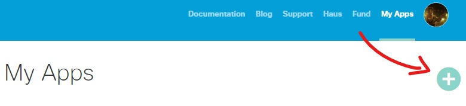
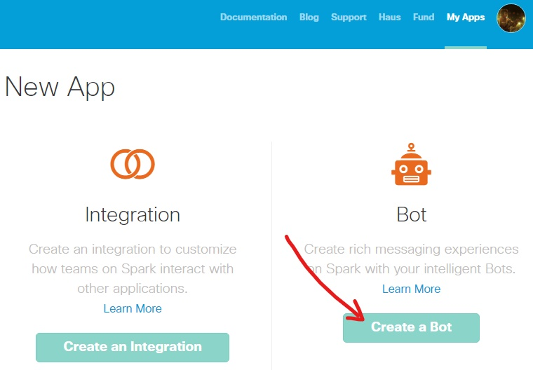
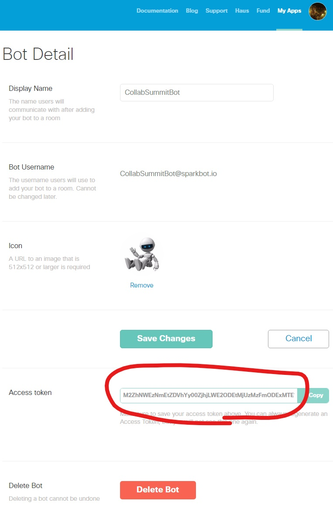
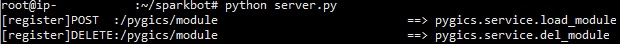
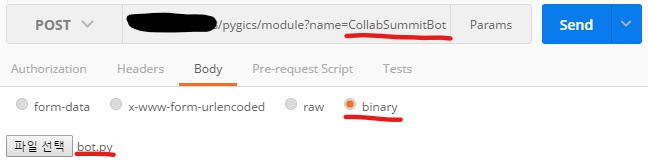

# sparkbot
Cisco Spark Service

version : 0.1.1

# How could bot deployed?

## 1. Create bot in Spark

### 1.1. Where is it? : Go to developer cisco spark dot com

[https://developer.ciscospark.com](https://developer.ciscospark.com)

### 1.2 Input bot descriptions

**Remember! Bot Username**

**Remember! Access Token**

## 2. Start bot in your host

### 2.1 Install Pygics Package

	pip install pygics

### 2.2 Run server on your public host

	python server.py

### 2.3 Upload bot logic with postman

	Method : POST
	URL : http://<Your Public Host>/pygics/module?name=<Bot Username>
	Body : bot.py File

**It's available to overwrite bot with same name**

# How could bot make?

	import pygics
	import sparkbot
	
	BOT_ID = ''
	BOT_KEY = ''
	BOT_SERVER = ''
	
	@pygics.api('POST', BOT_ID)
	@sparkbot.message(BOT_KEY, BOT_ID, BOT_SERVER)
	def episode(data, who, text):
	    #=========================================
	    # Write Code Here !
	    #=========================================
	    if text.lower() in ['hi', 'hello']:
	        return 'Hello!'
	    return '%s say that\n"%s"' % (who, text)

- "episode" function is main procedure.
- Must input "BOT_KEY", "BOT_ID" and "BOT_SERVER"
    - "BOT_KEY" is bot's access token on created "create bot in spark" phase.
    - "BOT_ID" is bot's username which you sure.
    - "BOT_SERVER" is your public host IP or hostname.
- @pygics.service is decorator of pygics which is registering URL to pygics.
- @sparkbot.message is decorator of sparkbot middleware which is parsing spark message hooked
- If you want to make your custom logic to write "episode" function.
    - "data" argument is raw data of spark messaging include of hooked data, person description and message description.
    - "who" argument is message sender's name.
    - "text" argument is message text.
    - return of "episode" function is message you want to send.